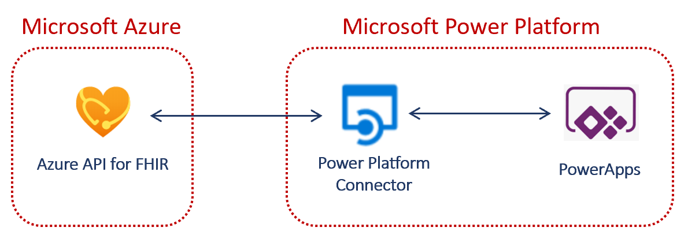

# PowerApps with Azure API for FHIR

[View other projects by our team](https://github.com/microsoft/emerging-opportunities/)

#### This repository hosts the guidance and reference architecture for using PowerApps with Azure API for FHIR. These are only samples to get started and doesn't include all FHIR resources or functionality.

## Scenario

**Enhance physician efficiency**. The PowerApps application with FHIR for doctors is an indispensable tool when it comes to orchestrating massive patient datasets, optimizing communication, and making their job less stressful with minimum paperwork. It helps get more reliable results and insights faster that might be needed for further patient treatment.

**Improve patient experience**. The PowerApps application with FHIR for patients ensures all their medical data is secure, while enabling patients access to their health data using user-friendly interface.

## Architecture

## Overview

### Azure API for FHIR
The healthcare industry is rapidly transforming health data to the emerging standard of FHIR® (Fast Healthcare Interoperability Resources). FHIR enables a robust, extensible data model with standardized semantics and data exchange that enables all systems using FHIR to work together. FHIR also enables the rapid exchange of data in applications. Backed by a managed PaaS [Azure API for FHIR](https://docs.microsoft.com/en-us/azure/healthcare-apis/overview) offering, FHIR also provides a scalable and secure environment for the management and storage of Protected Health Information (PHI) data in the native FHIR format.

### Power Platform Connectors for Azure API for FHIR
A connector is a proxy or a wrapper around an API that allows the underlying service to talk to Microsoft Power Platform. Connectors provide a way for users to leverage a set of pre-built actions and triggers to build applications and workflows.

The two Connectors that work with Azure API for FHIR contain a subset of FHIR Resources and are bi-directional, supporting both reads and writes to the FHIR Service.

**[FHIRBase](https://docs.microsoft.com/en-us/connectors/fhirbase/)** and **[FHIRClinical](
https://docs.microsoft.com/en-us/connectors/fhirclinical/)** are certified custom connectors that allows for building secure healthcare applications to enable interoperability using FHIR.

## Prerequisites

### Azure API for FHIR
- Deploy Azure API for FHIR with First Party Auth by [deploying via the Azure Portal](https://docs.microsoft.com/en-us/azure/healthcare-apis/fhir-paas-portal-quickstart). 
- To access the Azure API for FHIR, apply RBAC by adding users to `FHIR Data Reader` or `FHIR Data Contributor` role using Access Control (IAM). The users with access will authenticate through the Connector which assumes their role.
- Load sample data into Azure API for FHIR. 
    - Sample project to load data into FHIR can be found [here](./FHIR-Seed-Data)
    - Detailed instructions to load synthetic data can be found in the [OpenHack-FHIR Github](https://github.com/microsoft/OpenHack-FHIR/tree/main/Challenge01-AzureAPIforFHIR#task-2-generate--load-synthetic-data)
- See the following link for more details on [Using Azure API for FHIR](https://github.com/microsoft/OpenHack-FHIR)

### Power Platform
#### Certified Connector
- Get access to [Power Platform](https://docs.microsoft.com/en-us/power-platform/) environment to create Power Apps.
- Custom Connectors [FHIRBase](https://docs.microsoft.com/en-us/connectors/fhirbase/) and [FHIRClinical](
https://docs.microsoft.com/en-us/connectors/fhirclinical/) need to be added to your PowerPlatform Environment by an Environment Administrator.
- Details on [FHIRBase Actions](https://docs.microsoft.com/en-us/connectors/fhirbase/#actions) and [FHIRClinical Actions](https://docs.microsoft.com/en-us/connectors/fhirclinical/#actions) for API calls.
- Mapping [FHIR Base and Clinical Resources](https://www.hl7.org/fhir/resourcelist.html) to FHIRBase and FHIRClinical connectors.
- More details on [Power Apps](https://docs.microsoft.com/en-us/powerapps/)

#### Custom Connector
- Instructions to create your custom connector, can be found [here](./CUSTOM_CONNECTOR.md) 
- Sample custom connector can be found [here](./SampleFHIRCustomConnector)

## PowerApps - Healthcare Use Cases
This repository provides starter kit PowerApp pacakges with the ability to extend the App.

- **[Appointments](./Usecases/Appointments)**
- **[Practitioner Portal](./Usecases/Practitioner)**

## Contributing

This project welcomes contributions and suggestions.  Most contributions require you to agree to a Contributor License Agreement (CLA) declaring that you have the right to, and actually do, grant us
the rights to use your contribution. For details, visit https://cla.opensource.microsoft.com.

When you submit a pull request, a CLA bot will automatically determine whether you need to provide a CLA and decorate the PR appropriately (e.g., status check, comment). Simply follow the instructions provided by the bot. You will only need to do this once across all repos using our CLA.

This project has adopted the [Microsoft Open Source Code of Conduct](https://opensource.microsoft.com/codeofconduct/).
For more information see the [Code of Conduct FAQ](https://opensource.microsoft.com/codeofconduct/faq/) or contact [opencode@microsoft.com](mailto:opencode@microsoft.com) with any additional questions or comments.

## Trademarks

This project may contain trademarks or logos for projects, products, or services. Authorized use of Microsoft trademarks or logos is subject to and must follow [Microsoft's Trademark & Brand Guidelines](https://www.microsoft.com/en-us/legal/intellectualproperty/trademarks/usage/general).
Use of Microsoft trademarks or logos in modified versions of this project must not cause confusion or imply Microsoft sponsorship.
Any use of third-party trademarks or logos are subject to those third-party's policies.
