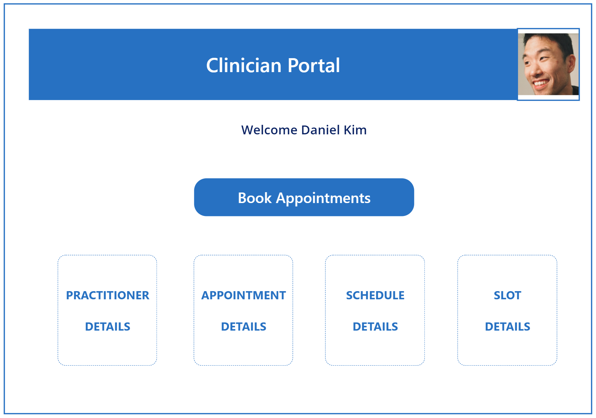
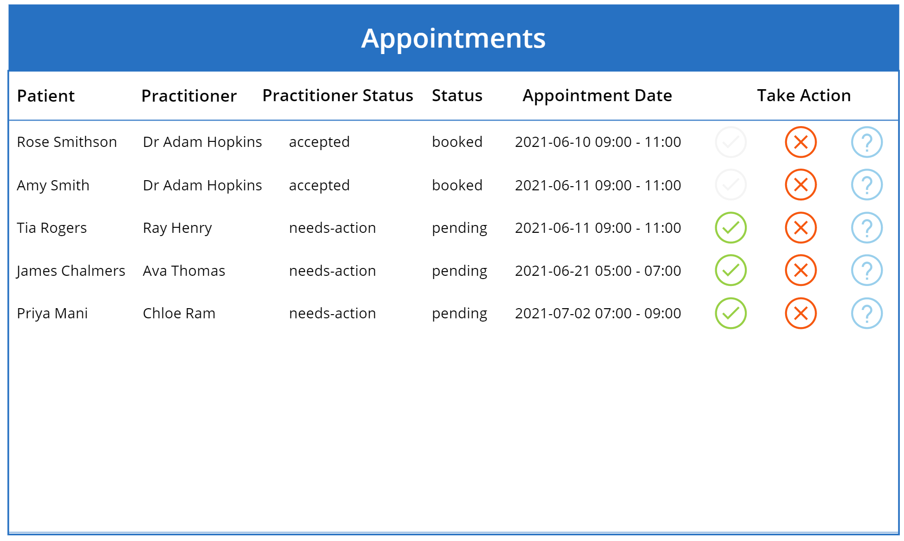
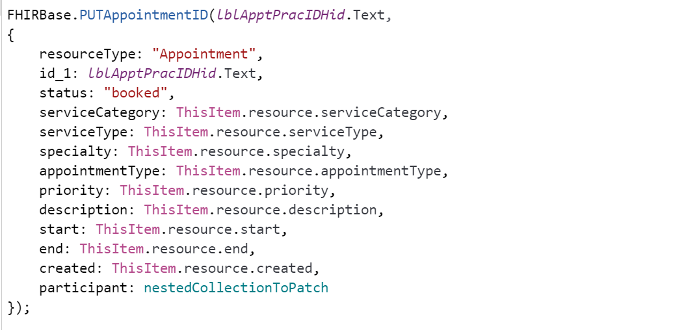
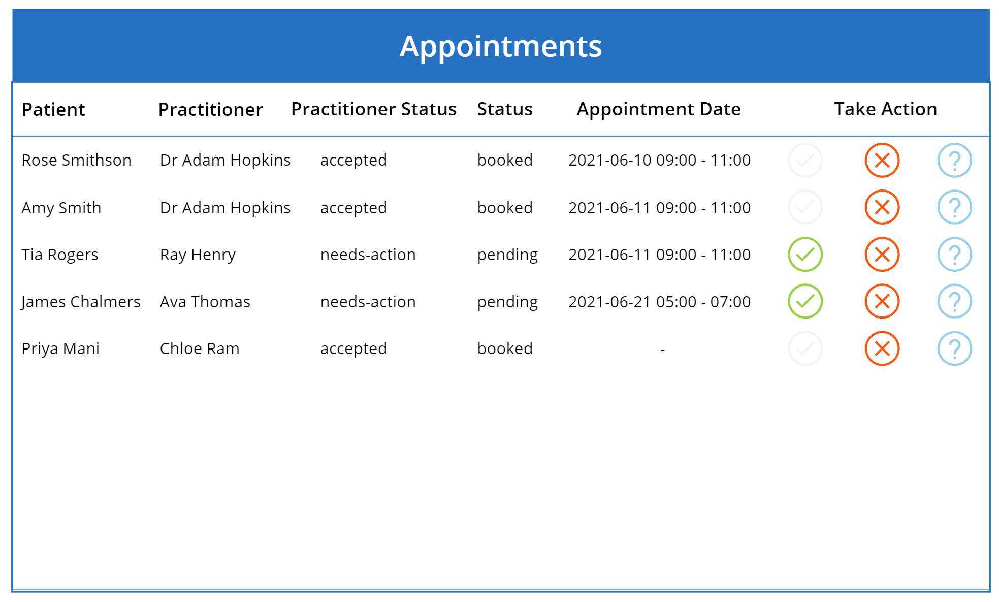

# Clinician App

## Getting Started
Steps to import the sample PowerApps package into your PowerApps environment.

### Import sample PowerApps package
- Download the sample package from here.
- Open your Power Apps Portal.
- Click Apps on the left ribbon.
- Click Import canvas app.
- Click Upload and choose the sample .zip file you downloaded.
- Click Update in IMPORT SETUP and select Create as new, enter Resource name and click Save.
- Click Import.

### Edit or Run imported Apps
- You will get a message All package resources were successfully imported.
- Click Apps on the left ribbon to see the App you imported. NOTE there might be a few minutes delay.
- Select the imported App, and choose Edit to look at the code, make changes, or Play to run the App.
- If you already have FHIRBase and FHIRClinical connectors added in Prerequisites above, you will get a popup - your App asking your permission to use the connectors, click Allow.
- Enter the URL of FHIR Server created in Prerequistes above. You can find the Azure API for FHIR service, in FHIR metadata endpoint with the metadata suffix. Ex: https://AzureAPIforFHIRName.azurehealthcareapis.com

### Clinician Portal 
When you run the clinician app you will be presented with the main page. Click on '**Book Appointment**' 

This button click will call _**ClearCollect()**_ function that clears and FHIRConnectorName._**GETAppointment**_ that loads Patient, Practitioner, Appointments data from FHIR Server into collections.

> ClearCollect(colAppointments, FHIRBase.GETAppointment().entry.resource);

> ClearCollect(colPatients, FHIRBase.GETPatient().entry.resource);

> ClearCollect(colPractioners, FHIRBase.GETPractitioner().entry.resource);

After retrieving the data the same button action ('_onSelect_') will navigate the app to screen called _scrAppointments_

> Navigate(scrAppointments);

## Appointment Screen
The gallery shows data from collection colAppointments.

The Clinician can respond to the appointment request by clicking on one of the three icons (_Accept, Decline, Tentative_).

### Accept/Decline/Tentative
Once the clinician clicks on one of the three choices, the button click will call FHIRConnectorName_**PUTAppointmentID**_ that updates Practitioner and Appointments status in FHIR Server. 
> FHIRBase.PUTAppointmentID()

 
**NOTE:** FHIR Server as of when this is written doesn't support PATCH, so '_**Patch()**_ function to update nested Participant object which is then passed to _**PUTAppointmentID**_ to update the statuses.

