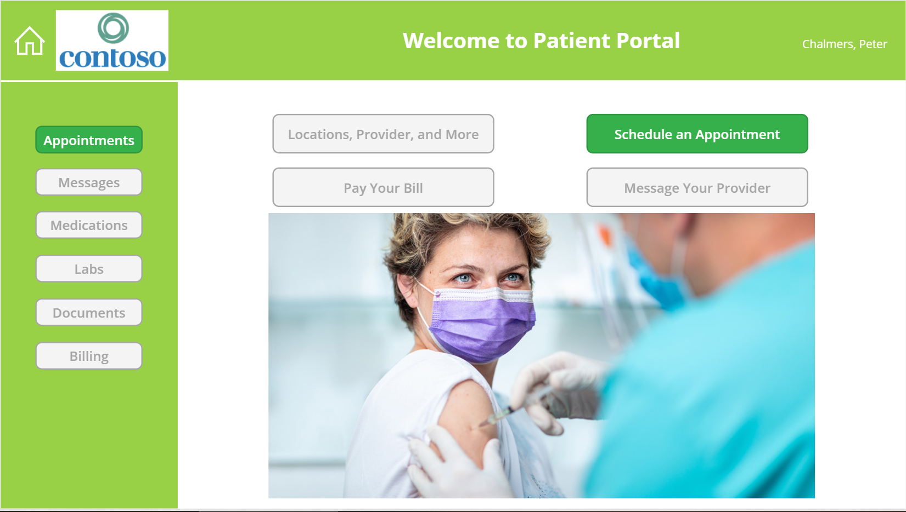
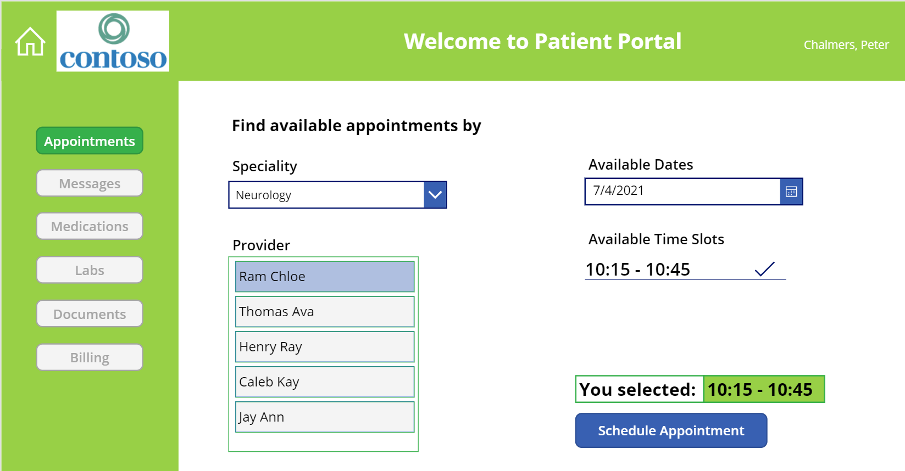
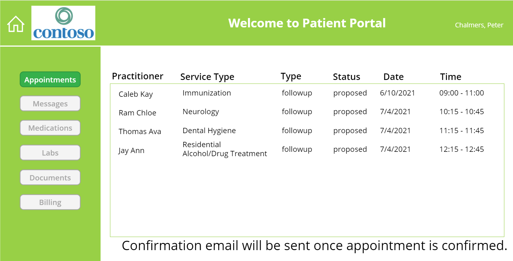

# Patient App

## Getting Started
Steps to import the sample PowerApps package into your PowerApps environment.

### Import sample PowerApps package
- Download the sample package from here.
- Open your Power Apps Portal.
- Click Apps on the left ribbon.
- Click Import canvas app.
- Click Upload and choose the sample .zip file you downloaded.
- Click Update in IMPORT SETUP and select Create as new, enter Resource name and click Save.
- Click Import.

### Edit or Run imported Apps
- You will get a message All package resources were successfully imported.
- Click Apps on the left ribbon to see the App you imported. NOTE there might be a few minutes delay.
- Select the imported App, and choose Edit to look at the code, make changes, or Play to run the App.
- If you already have FHIRBase and FHIRClinical connectors added in Prerequisites above, you will get a popup - your App asking your permission to use the connectors, click Allow.
- Enter the URL of FHIR Server created in Prerequistes above. You can find the Azure API for FHIR service, in FHIR metadata endpoint with the metadata suffix. Ex: https://AzureAPIforFHIRName.azurehealthcareapis.com

### Patient Portal Home Screen
When you run the Patient app you will be presented with the main page. 

### Request Appointment Screen

### Appointment Info Screen

