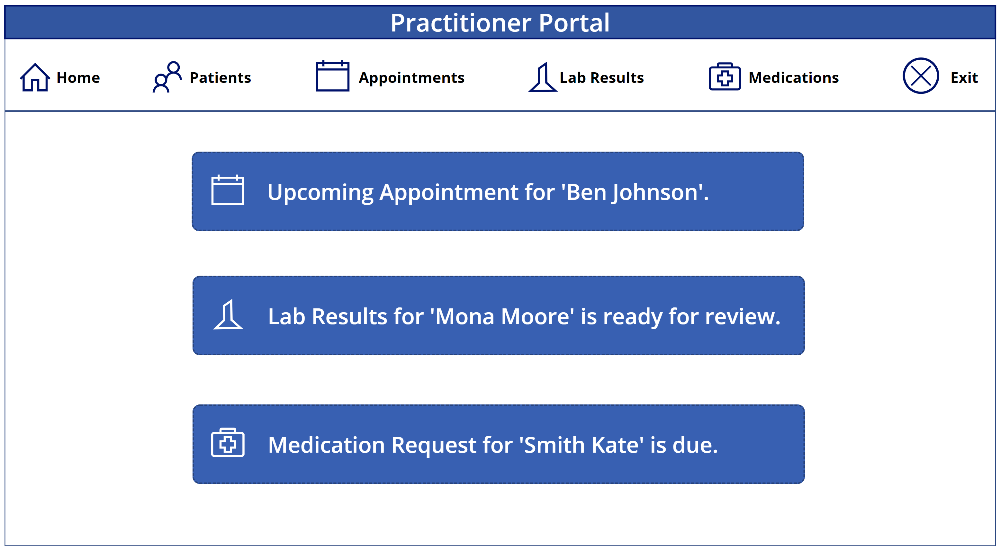
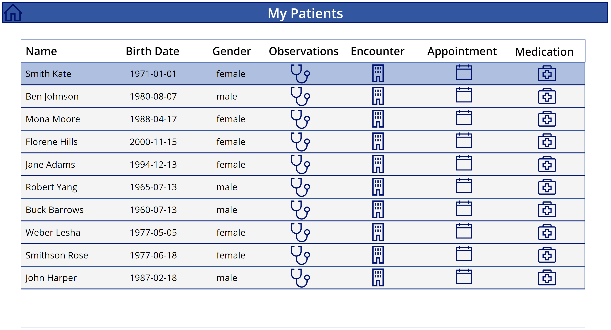
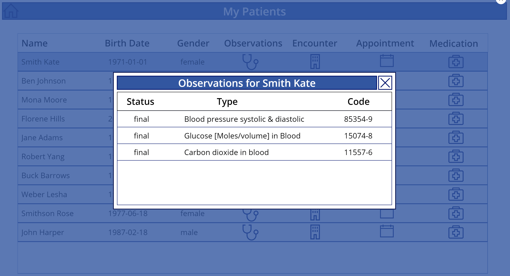
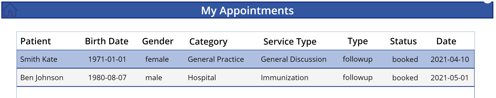
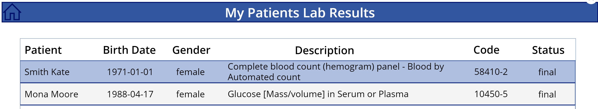
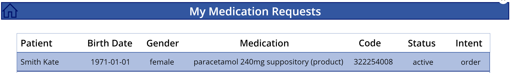

# Practitioner 
A person who is directly or indirectly involved in the provisioning of healthcare.

## [FHIR Resources](http://hl7.org/fhir/)
- [Practitioner](https://www.hl7.org/fhir/practitioner.html) resource covers all individuals who are engaged in the healthcare process and healthcare-related services as part of their formal responsibilities.
- [Patient](https://www.hl7.org/fhir/patient.html) resource covers the "who" information about the patient.
- [Appointment](https://www.hl7.org/fhir/appointment.html) resource is used to provide information about a planned meeting that may be in the future or past.
- [Lab Results](https://www.hl7.org/fhir/diagnosticreport.html) resource covers findings and interpretation of diagnostic tests performed on patients, groups of patients, devices, and locations, and/or specimens derived from these.
- [Medication](https://www.hl7.org/fhir/medication.html) resource is primarily used for the identification and definition of a medication for the purposes of prescribing, dispensing, and administering a medication as well as for making statements about medication use.

## Getting Started
Steps to import the sample PowerApps package into your PowerApps environment.

### Import sample PowerApps package
- Download the sample package from here.
- Open your Power Apps Portal.
- Click Apps on the left ribbon.
- Click Import canvas app.
- Click Upload and choose the sample .zip file you downloaded.
- Click Update in IMPORT SETUP and select Create as new, enter Resource name and click Save.
- Click Import.

### Edit or Run imported Apps
- You will get a message All package resources were successfully imported.
- Click Apps on the left ribbon to see the App you imported. NOTE there might be a few minutes delay.
- Select the imported App, and choose Edit to look at the code, make changes, or Play to run the App.
- If you already have FHIRBase and FHIRClinical connectors added in Prerequisites above, you will get a popup - your App asking your permission to use the connectors, click Allow.
- Enter the URL of FHIR Server created in Prerequistes above. You can find the Azure API for FHIR service, in FHIR metadata endpoint with the metadata suffix. Ex: https://AzureAPIforFHIRName.azurehealthcareapis.com

### Practitioner Portal 
Home page shows the upcoming notifications for the practitioner. 

### Patients Screen
The gallery shows patient list and clickable icons to view their observations, encounters, appointments and medications.

### Other Screens

